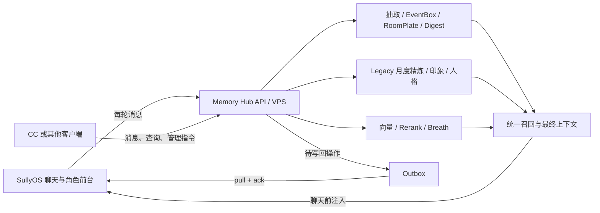

# SullyOS Memory Hub

SullyOS Memory Hub 是 SullyOS 的独立外置记忆库和后置认知设备。

它不是 SullyOS 的替代前端，也不是只读的数据看板。它负责接收对话和外部材料，运行与 SullyOS 对齐的记忆处理，维护长期状态，并向 SullyOS、CC 或其他客户端返回可直接注入模型上下文的召回结果。

> 当前结论：Hub 的记忆处理主干已经可以独立运行；但 SullyOS 的真实聊天发送、聊天前召回以及 Hub 写回 SullyOS 尚未全部接通。因此目前是“独立记忆运行时已成立，双向产品闭环未完成”。

## 产品边界

### SullyOS 负责

- 聊天和角色生活体验
- 世界书、角色卡、示例对话和聊天消息
- 应用、游戏、剧场、语音等前台功能
- 在过渡阶段保存一部分角色源数据

### Memory Hub 负责

- MemoryNode、七房间和 RoomPlate
- EventBox、摘要、归档和压缩
- Anticipation（期盼）的生命周期
- 抽取、迁移、消化、人格检测和印象生成
- Legacy 日度碎片、月度精炼和月份召回
- embedding、rerank、向量队列和语义召回
- Breath、召回审计、备份、同步和维护
- 在 VPS 上作为 SullyOS 与 CC 共用的记忆 API

### Memory Hub 不负责

- 复制 SullyOS 的聊天界面和游戏功能
- 擅自改写 SullyOS 原版 prompt 或七房间语义
- 用 Ombre 的记忆语义替换 SullyOS 的 Memory Palace 语义
- 自动硬删除“遗忘”的记忆

## 目标架构



部署到 VPS 后，SullyOS 和 CC 都应主动连接 Hub。CC 不需要直接连接用户本机的 SullyOS；需要修改角色状态时，由 Hub 记录写回操作，SullyOS 拉取、确认并执行。

## 当前完成度

| 体系 | 当前状态 | 说明 |
| --- | --- | --- |
| 七房间 Memory Palace | 已完成 | `living_room`、`bedroom`、`study`、`user_room`、`self_room`、`attic`、`windowsill` |
| SullyOS prompt 搬运 | 已完成 | 抽取、迁移、外部记忆、EventBox、RoomPlate、digest、人格检测均保留原语义 |
| 记忆抽取 | 已完成 | 保留 `relatedTo`、`sameAs`、`eventName`、`eventTags` |
| EventBox | 已完成 | 绑定、压缩、重压缩、摘要和归档；支持原版与增强展开 |
| RoomPlate | 已完成 | 整理、更新和常驻召回；保留 bedroom 禁止关系命名规则 |
| Anticipation | 已完成 | 保留 `fulfill`、`disappoint`、`keep` 生命周期 |
| Digest | 已完成 | 自动轮次、手动运行、窗口期盼、事件盒和门牌处理 |
| self insight | 已完成 | 旧 `selfInsights` 保真；新 `self_insight` 写入 self_room 的“我是谁”门牌 |
| Legacy 月度记忆 | 已完成 | 日度 MemoryFragment 精炼到 `refinedMemories[YYYY-MM]`，支持月份激活与 `[[RECALL: YYYY-MM]]` |
| UserImpression v3.0 | 已完成 | 首次生成读取近期 15 条，更新读取近期 50 条，并结合长期角色上下文 |
| 人格检测 | 部分完成 | 检测 API 已有；仍需补齐 SullyOS 的“待确认 -> 用户确认 -> 写回角色”完整流程 |
| 向量写回 | 已完成 | 新增、修改、归档和摘要状态进入 embedding 队列，rerank 可参与召回 |
| SullyOS 格式化召回 | 已完成 | EventBox、pinned、RoomPlate、windowsill、archived 过滤和最终 prompt 分段 |
| 召回审计 | 已完成 | 可查看候选、触发节点、展开盒、跳过项和最终注入段落 |
| Breath | 已完成基础能力 | 搜索召回用于真实读取；自动浮现、目录、高重要度和 Feel 用于探索管理 |
| SullyOS 快照同步 | 已完成 | 支持角色、记忆、门牌、事件盒、期盼、digest 等导入与镜像删除 |
| 每轮聊天自动接入 | 未完成 | SullyOS 尚未在真实聊天链稳定 POST `/api/runtime/messages` |
| 聊天前使用 Hub 召回 | 未完成 | SullyOS 当前仍主要调用本地 `injectMemoryPalace` |
| Hub 写回 SullyOS | 未完成 | 还缺 outbox、拉取、确认、重试和冲突处理 |

## SullyOS、Hub 与 Ombre Brain 的差异

| 维度 | SullyOS | Memory Hub | Ombre Brain |
| --- | --- | --- | --- |
| 核心定位 | 角色聊天和完整前台产品 | SullyOS 兼容的独立外置记忆运行时 | 通用长期记忆/脑状态架构参考 |
| 权威语义 | Memory Palace、Legacy、角色认知 | 原版模式严格对齐 SullyOS，并允许显式增强 | bucket、索引、激活、生命力和维护 |
| 数据入口 | 本地聊天和角色状态 | API、导入、SullyOS 同步、CC | 通常由上层应用喂入 |
| 房间 | 七房间固定语义 | 七房间逐字对齐 | 不以 SullyOS 七房间为核心 |
| 事件聚合 | EventBox | 原版兼容 + 可切换增强展开 | 可作为聚合和索引参考 |
| 长期认知 | 印象、self insight、人格、月度记忆 | 独立生成、保存、召回和管理 | 更侧重通用脑状态和记忆维护 |
| 召回 | SullyOS 本地 formatter | 等价 formatter + 完整审计 + rerank | 语义检索、激活和 Breath 思路 |
| 遗忘 | 房间衰减、容量、降级到 attic、摘要吸收 | 已搬运 SullyOS consolidation；另有只读 vitality | 半衰期、激活次数和生命力更突出 |
| UI | SullyOS 内部页面 | 专用记忆管理后台 | 不是 Hub 必须复制的界面 |

Ombre Brain 对 Hub 的价值主要是工程增强：Breath、生命力、向量索引、维护视图和外部脑部署。所有这些增强必须与 SullyOS 原始语义分层，不能悄悄改变原版召回结果。

## 记忆处理主干

```text
消息或导入材料
  -> 记忆抽取
  -> relatedTo / sameAs / eventName / eventTags
  -> EventBox 绑定
  -> 达到阈值后压缩
  -> RoomPlate 更新
  -> Anticipation 处理
  -> 每 N 轮或手动 digest
  -> embedding / 重新 embedding
  -> recall + rerank + formatter
  -> 返回最终可注入上下文
```

运行时消息接口具备 `sourceId` 幂等、按角色锁、失败恢复和高水位控制。新消息只有在记忆处理和向量写入达到安全状态后才推进处理水位。

## 召回与 EventBox

### SullyOS 原版模式

- 命中 EventBox 任一节点即展开整个盒子
- 一个 EventBox 占一个召回名额
- summary 必带
- archived 节点不直接输出
- live nodes 按原版时间规则取最多 8 条

### 增强展开模式

- 命中的 live node 必带
- 其余节点按 importance、recency、query similarity 补足
- 默认总 live nodes 为 5，可配置
- 超出部分返回 omitted count
- 审计记录每个 live node 被选中的原因

增强模式是显式开关，不覆盖原版模式。

召回 trace 包含：候选池、EventBox 触发节点、展开的 EventBox、pinned、RoomPlate、windowsill、跳过的 archived，以及最终真正塞给模型的 prompt 分段。

## Breath

Breath 有两类用途，不能混为一谈：

- **搜索召回**：调用完整 `/api/recall`，用于聊天或模型请求前的真实记忆读取。
- **探索与管理**：自动浮现、目录、高重要度、Feel 通道，用于浏览和维护记忆，不等于 SullyOS formatter 的最终上下文。

Ombre 风格 vitality 综合 importance、年龄、最近激活、激活次数和 pinned 状态，显示 active、stable、dormant、cold、core。它目前用于排序和观察，不直接修改 SullyOS 的房间、importance 或删除数据。

## 遗忘与 Consolidation

Hub 已实现 SullyOS 风格的记忆整理：

- importance >= 8 可晋升
- importance >= 6 且超过 24 小时可晋升
- accessCount >= 3 可晋升
- living_room 默认容量 200
- 超出容量时，最低有效重要度记忆移入 attic，而不是删除
- self_room、attic、windowsill 保留各自的原版时间规则
- EventBox 通过 summary 吸收 archived 细节
- digest 可以降低无效材料的重要度

Hub 不把“遗忘”实现成自动硬删除。删除必须是明确操作，并进入同步审计。

## Legacy、印象与人格

### Legacy 月度记忆

SullyOS 的日度 MemoryFragment 与 Memory Palace 是两条并行记忆线。Hub 已保留 Legacy 月度精炼：

- 按月收集日度 MemoryFragment
- 使用 SullyOS 原版月度模板生成 `refinedMemories[YYYY-MM]`
- 激活月份后可注入该月的详细记忆
- 支持 `[[RECALL: YYYY-MM]]`

### TA 对用户的印象

Hub 按 SullyOS UserImpression v3.0 工作：

- 首次生成读取最近 15 条聊天
- 更新读取最近 50 条聊天
- 长期人格判断优先使用完整角色上下文和全时间线记忆
- 近期聊天主要更新情绪摘要和观察到的变化
- 结果写入对应角色的 impression 状态

### self insight

- 同步到的旧 `char.selfInsights` 原样保留并继续兼容注入
- 新 digest 产生的 `self_insight` 不再追加旧数组
- 新领悟写入 self_room 的“我是谁”RoomPlate

### 性格状态

目标行为与 SullyOS 相同：缺失 `personalityStyle` 时检测一次，也可手动重测；结果先展示，用户确认后再写回角色。当前仍需补齐确认和角色写回闭环。

## 同步与权威数据

当前推荐过渡模式：**SullyOS 主数据 + Hub 独立镜像处理 + 显式写回**。

已支持：

- SullyOS 全量快照导入
- MemoryNode 增量追加和更新
- SullyOS 删除后在 Hub 镜像删除
- 只保留角色的最新档案状态，不把每次同步误当成多个并列档案
- 按 `charId` 隔离角色记忆

仍需实现：

- SullyOS 每轮聊天自动推送
- impression、refinedMemories、activeMemoryMonths、personality 等角色字段的即时增量同步
- Hub outbox：待写回操作、版本、来源和时间
- SullyOS pull/ack/retry
- 删除、覆盖和并发修改的冲突预览
- 最终 Hub-primary 模式

在双向同步完成前，不应宣传为“Hub 已完全替代 SullyOS 本地记忆存储”。

## VPS 与 CC 接入

建议 API 流程：

1. SullyOS 每轮聊天结束后 POST `/api/runtime/messages`。
2. Hub 独立运行抽取、EventBox、RoomPlate、digest 和向量任务。
3. 下一次模型请求前，SullyOS 或 CC POST `/api/recall`。
4. 客户端只使用返回的最终 formatter 上下文，不自行重写七房间语义。
5. 需要修改 SullyOS 角色字段时，Hub 写入 outbox。
6. SullyOS 定时拉取、展示冲突、执行并 ACK。

VPS 还需要补充设备级 token、角色权限、离线重试、任务调度和数据库备份。

## 主要 API

### 运行时与召回

- `POST /api/runtime/messages`
- `GET /api/runtime/status`
- `POST /api/runtime/process`
- `POST /api/recall`
- `POST /api/breath`

### Memory Palace

- `POST /api/memory/extract`
- `POST /api/memory/migrate-month`
- `POST /api/memory/import-external`
- `POST /api/memory/eventbox/compress`
- `POST /api/memory/eventbox/recompress`
- `POST /api/memory/plates/consolidate`
- `POST /api/memory/digest/run`
- `POST /api/memory/digest/tick`
- `POST /api/memory/personality/detect`
- `POST /api/memory/consolidate`

### Legacy 与角色认知

- `GET /api/legacy/status`
- `GET /api/legacy/context`
- `POST /api/legacy/refine-month`
- `POST /api/legacy/months/activate`
- `POST /api/legacy/recall`
- `GET /api/impression/status`
- `POST /api/impression/generate`

### SullyOS 同步

- `/api/sully/contexts`
- `/api/sully/characters`
- `/api/sully/memories`
- `/api/sully/room-plates`
- `/api/sully/event-boxes`
- `/api/sully/anticipations`
- `/api/sully/digest-reports`

完整字段和请求格式以 `server.mjs` 的路由实现为准。

## 模型配置

Hub 分别配置：

- embedding：向量生成
- lightLLM：抽取、压缩、digest、Legacy 和认知任务
- rerank：召回二次排序

配置可从 SullyOS 同步，也可使用 VPS 环境变量或手动配置。API key 可以在 UI 中遮罩，但服务端必须实际读取并用于请求。生产部署不要把 key 返回给浏览器。

## 存储与备份

当前 Hub 仍以 JSON 数据文件为主要持久化方式。导出备份应覆盖 Hub 自身状态，包括角色、记忆、门牌、事件盒、期盼、digest、Legacy、印象、人格、向量元数据和配置；密钥应单独处理，不默认写入可分享备份。

当前数据量已经不适合长期依赖单一大 JSON。下一阶段应迁移到 SQLite 或等价的事务型存储，并建立：

- 按 charId、room、时间、EventBox 和向量状态的索引
- 原子事务和崩溃恢复
- 增量备份和迁移版本
- 避免每次操作重写整个数据文件

## 优先更新清单

### P0：完成真实闭环

1. 在 SullyOS 真实聊天提交点接入 `/api/runtime/messages`。
2. 在 SullyOS 模型请求前接入 Hub `/api/recall`。
3. 实现 Hub outbox 与 SullyOS pull/ack/retry/conflict。

### P1：补齐 SullyOS 角色认知

1. 完成人格检测的确认后写回。
2. 增量同步 impression、Legacy 月份和角色认知字段。
3. 补齐世界书、示例对话、语音摘要等可选完整上下文段。
4. 对齐语音、卡片、剧场和系统事件的消息语义格式化。
5. 对齐召回后的 `accessCount`、`lastAccessedAt` 回执。

### P2：生产化

1. JSON 迁移 SQLite。
2. 加入 VPS 调度器、持久任务队列和离线恢复。
3. 加入设备 token、角色权限和审计日志。
4. 建立 SullyOS 与 Hub 的跨仓库 golden parity 测试。
5. 清理重复快照、临时恢复文件和过期文档，但必须先备份并验证引用。

## 对齐验收标准

原版模式只有在以下条件成立时才算与 SullyOS 对齐：

- 相同输入、角色、历史状态和模型配置
- 使用相同 prompt 和七房间规则
- 保留所有关键字段和禁止规则
- 得到语义等价的 MemoryNode、EventBox、RoomPlate、Anticipation 和 Legacy 状态
- 召回具有相同的名额规则、展开规则和最终注入结构
- 增强功能可以关闭，并且关闭后不污染原版结果

任何 prompt 修改都必须先展示完整 prompt 并经用户确认。

## 本地运行

要求 Node.js 18 或更高版本。

```powershell
npm start
```

默认访问：`http://127.0.0.1:8787/`

运行回归测试：

```powershell
npm run test:runtime
```

## 相关文档

- `ARCHITECTURE_PRINCIPLES.md`：不可破坏的架构原则
- `MEMORY_PALACE_PROMPT_PORTING_FOR_CODEX.md`：Memory Palace prompt 搬运范围和约束
- `README_QUICKSTART.md`：快速启动
- `README_DEPLOY.md`：VPS 部署
- `.env.example`：环境变量示例
