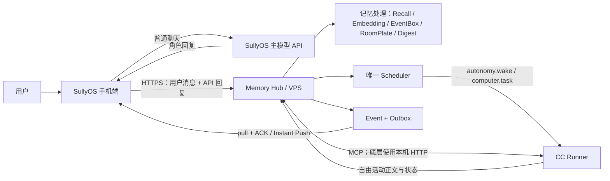

# SullyOS Memory Hub

SullyOS Memory Hub 是 SullyOS 的独立外置记忆库和后置认知设备。

它不是 SullyOS 的替代前端，也不是只读的数据看板。它负责接收对话和外部材料，运行与 SullyOS 对齐的记忆处理，维护长期状态，并向 SullyOS、CC 或其他客户端返回可直接注入模型上下文的召回结果。

> 当前结论（2026-08-06）：Hub 端的 V2 权威存储、命令/事件、Scheduler、Outbox、MCP 和 CC Runner 已实现并通过回归测试；本地真实数据也已完成 V2 parity 校验与提升。尚未完成的是 VPS 正式部署、SullyOS 每轮消息增量上送、SullyOS Outbox pull/ACK，以及第一次真实 CC 唤醒。因此当前状态是“服务端 Bridge 已具备，线上端到端 Bridge 尚未接通”。

## 产品边界

### SullyOS 负责

- 手机端普通聊天、气泡、卡片、音乐、通知和用户交互
- 普通聊天暂时继续使用 SullyOS 当前主模型 API
- 世界书、角色卡、示例对话和聊天消息
- 应用、游戏、剧场、语音等前台功能
- 在过渡阶段保存可重建的本地缓存

### Memory Hub 负责

- MemoryNode、七房间和 RoomPlate
- EventBox、摘要、归档和压缩
- Anticipation（期盼）的生命周期
- 抽取、迁移、消化、人格检测和印象生成
- Legacy 日度碎片、月度精炼和月份召回
- embedding、rerank、向量队列和语义召回
- Breath、召回审计、备份、同步和维护
- 角色档案、完整消息、记忆、状态、事件和任务的权威数据
- Scheduler、Event、Outbox、ACK、重试和幂等控制
- 在 VPS 上作为 SullyOS 与 CC 共用的权威 API

### CC / Claude Code 负责

- 事件触发的随机自由活动、电脑操作、Code 区任务和复杂长期任务
- 通过 MCP 读取 Hub 提供的角色上下文、增量聊天、状态与召回结果
- 将自由活动结果原样提交给 Hub，不再经过普通聊天 API 二次润色
- 普通聊天默认不调用 CC；CC 也不直接读取 `authority.sqlite`

### Memory Hub 不负责

- 复制 SullyOS 的聊天界面和游戏功能
- 擅自改写 SullyOS 原版 prompt 或七房间语义
- 自动硬删除“遗忘”的记忆

## 目标架构



这里有两条 Bridge：SullyOS ↔ Hub 使用 HTTPS、Outbox 和 ACK；CC ↔ Hub 使用 MCP。禁止形成 `Hub → CC → 普通 API` 的双模型串行回复。CC 不直接连接 SullyOS，也不下载完整记忆库。

## 当前完成度

| 体系 | 当前状态 | 说明 |
| --- | --- | --- |
| 七房间 Memory Palace | 已完成 | `living_room`、`bedroom`、`study`、`user_room`、`self_room`、`attic`、`windowsill` |
| SullyOS prompt 搬运 | 已完成 | 抽取、迁移、外部记忆、EventBox、RoomPlate、digest、人格检测均保留原语义 |
| 记忆抽取 | 已完成 | 保留 `relatedTo`、`sameAs`、`eventName`、`eventTags` |
| EventBox | 已完成 | 绑定、压缩、重压缩、摘要和归档；支持原版与增强展开 |
| RoomPlate | 已完成 | 整理、更新和常驻召回；保留 bedroom 禁止关系命名规则 |
| Anticipation | 已完成 | 保留 `fulfill`、`disappoint`、`keep` 生命周期 |
| Digest | 已完成 | 自动轮次、手动运行、窗口期盼、事件盒和门牌处理 |
| self insight | 已完成 | 旧 `selfInsights` 保真；新 `self_insight` 写入 self_room 的“我是谁”门牌 |
| Legacy 月度记忆 | 已完成 | 日度 MemoryFragment 精炼到 `refinedMemories[YYYY-MM]`，支持智能月份下拉激活；API 仍兼容 `[[RECALL: YYYY-MM]]` |
| UserImpression v3.0 | 已完成 | 首次生成读取近期 15 条，更新读取近期 50 条，并结合长期角色上下文 |
| 人格检测 | 部分完成 | 检测 API 已有；仍需补齐 SullyOS 的“待确认 -> 用户确认 -> 写回角色”完整流程 |
| 向量写回 | 已完成 | 新增、修改、归档和摘要状态进入 embedding 队列，rerank 可参与召回 |
| SullyOS 格式化召回 | 已完成 | EventBox、pinned、RoomPlate、windowsill、archived 过滤和最终 prompt 分段 |
| 召回审计 | 已完成 | 可查看候选、触发节点、展开盒、跳过项和最终注入段落 |
| Breath | 已完成基础能力 | 搜索召回用于真实读取；自动浮现、目录、高重要度和 Feel 用于探索管理 |
| SullyOS 快照同步 | 已完成 | 支持角色、记忆、门牌、事件盒、期盼、digest 等导入与镜像删除 |
| V2 SQLite 权威运行时 | 已完成（本地） | 已完成真实数据 parity 与提升；运行读源为 V2 authority，原始大 JSON 仅保留迁移/恢复兼容 |
| Command / Event / Snapshot / Scheduler | 已完成（Hub 端） | 稳定 ID、事件序号、角色快照、任务领取、忙碌延期和幂等处理均已实现 |
| MCP 与 CC Runner | 已完成（代码与测试） | 9 个 MCP 工具、角色会话恢复、增量上下文和 `brain.wake` / `autonomy.wake` 执行链已实现；尚未做真实 VPS 唤醒 |
| Outbox / ACK / retry | 已完成（Hub 端） | 可靠投递、客户端游标、ACK 与指数退避已实现；SullyOS 客户端持续 pull/ACK 尚未接通 |
| 每轮聊天自动接入 | 未完成 | SullyOS 尚未在真实聊天链稳定 POST `/api/runtime/messages` |
| 聊天前使用 Hub 召回 | 未完成 | SullyOS 当前仍主要调用本地 `injectMemoryPalace` |
| Hub 写回 SullyOS | 部分完成 | Hub Outbox 已完成；还缺 SullyOS 侧拉取、渲染、ACK 与真实设备联调 |

## 记忆处理主干

```text
消息或导入材料
  -> 记忆抽取
  -> relatedTo / sameAs / eventName / eventTags
  -> EventBox 绑定
  -> 达到阈值后压缩
  -> RoomPlate 更新
  -> Anticipation 处理
  -> 每 N 轮或手动 digest
  -> embedding / 重新 embedding
  -> recall + rerank + formatter
  -> 返回最终可注入上下文
```

运行时消息接口具备 `sourceId` 幂等、按角色锁、失败恢复和高水位控制。新消息只有在记忆处理和向量写入达到安全状态后才推进处理水位。

## 召回与 EventBox

### SullyOS 原版模式

- 命中 EventBox 任一节点即展开整个盒子
- 一个 EventBox 占一个召回名额
- summary 必带
- archived 节点不直接输出
- live nodes 按原版时间规则取最多 8 条

### 增强展开模式

- 命中的 live node 必带
- 其余节点按 importance、recency、query similarity 补足
- 默认总 live nodes 为 5，可配置
- 超出部分返回 omitted count
- 审计记录每个 live node 被选中的原因

增强模式是显式开关，不覆盖原版模式。

召回 trace 包含：候选池、EventBox 触发节点、展开的 EventBox、pinned、RoomPlate、windowsill、跳过的 archived，以及最终真正塞给模型的 prompt 分段。

## Breath

Breath 有两类用途，不能混为一谈：

- **搜索召回**：调用完整 `/api/recall`，用于聊天或模型请求前的真实记忆读取。
- **探索与管理**：自动浮现、目录、高重要度、Feel 通道，用于浏览和维护记忆，不等于 SullyOS formatter 的最终上下文。

只读 vitality 综合 importance、年龄、最近激活、激活次数和 pinned 状态，显示 active、stable、dormant、cold、core。它目前用于排序和观察，不直接修改 SullyOS 的房间、importance 或删除数据。

## 遗忘与 Consolidation

Hub 已实现 SullyOS 风格的记忆整理：

- importance >= 8 可晋升
- importance >= 6 且超过 24 小时可晋升
- accessCount >= 3 可晋升
- living_room 默认容量 200
- 超出容量时，最低有效重要度记忆移入 attic，而不是删除
- self_room、attic、windowsill 保留各自的原版时间规则
- EventBox 通过 summary 吸收 archived 细节
- digest 可以降低无效材料的重要度

Hub 不把“遗忘”实现成自动硬删除。删除必须是明确操作，并进入同步审计。

## Legacy、印象与人格

### Legacy 月度记忆

SullyOS 的日度 MemoryFragment 与 Memory Palace 是两条并行记忆线。Hub 已保留 Legacy 月度精炼：

- 按月收集日度 MemoryFragment
- 使用 SullyOS 原版月度模板生成 `refinedMemories[YYYY-MM]`
- 激活月份后可注入该月的详细记忆
- 支持按月份下拉召回详细日志；当前月无记录时自动选择最近有记录的月份，API 仍兼容 `[[RECALL: YYYY-MM]]`

### TA 对用户的印象

Hub 按 SullyOS UserImpression v3.0 工作：

- 首次生成读取最近 15 条聊天
- 更新读取最近 50 条聊天
- 长期人格判断优先使用完整角色上下文和全时间线记忆
- 近期聊天主要更新情绪摘要和观察到的变化
- 结果写入对应角色的 impression 状态

### self insight

- 同步到的旧 `char.selfInsights` 原样保留并继续兼容注入
- 新 digest 产生的 `self_insight` 不再追加旧数组
- 新领悟写入 self_room 的“我是谁”RoomPlate

### 性格状态

目标行为与 SullyOS 相同：缺失 `personalityStyle` 时检测一次，也可手动重测；结果先展示，用户确认后再写回角色。当前仍需补齐确认和角色写回闭环。

## 同步与权威数据

当前推荐过渡模式：**Hub 权威运行时 + SullyOS 本地可重建缓存 + 一次性迁移/灾难恢复对比**。

已支持：

- SullyOS 全量快照导入
- MemoryNode 增量追加和更新
- SullyOS 删除后在 Hub 镜像删除
- 只保留角色的最新档案状态，不把每次同步误当成多个并列档案
- 按 `charId` 隔离角色记忆

Hub 端已实现：

- V2 增量行表与本地真实数据提升
- commands、events、character snapshots、scheduled jobs、outbox deliveries、client cursors 与 idempotency keys
- CC wake 领取、角色会话元数据、MCP 上下文读取与活动提交

仍需接通：

- SullyOS 每轮聊天自动推送
- impression、refinedMemories、activeMemoryMonths、personality 等角色字段的即时增量同步
- SullyOS pull/ack/retry
- 删除、覆盖和并发修改的冲突预览
- VPS 上的 HTTPS 入口、进程守护、数据库部署和首次真实 CC wake

在双向同步完成前，不应宣传为“Hub 已完全替代 SullyOS 本地记忆存储”。

## VPS 与 CC 接入

目标运行流程：

1. SullyOS 每轮聊天结束后 POST `/api/runtime/messages`。
2. Hub 独立运行抽取、EventBox、RoomPlate、digest 和向量任务。
3. 普通聊天继续由 SullyOS 主模型 API 完成，不经过 CC。
4. Hub Scheduler 到期后创建 wake；CC Runner 只在事件触发时恢复对应角色会话。
5. Hub 在唤醒前自动组装稳定人格层、增量聊天、状态变化、3–5 条召回记忆和未完成任务。
6. CC 通过 MCP 深度查询并将自由活动结果原样写入 Hub。
7. Hub 通过 Event + Outbox 投递；SullyOS 拉取、渲染并 ACK。

VPS 尚未实际部署。部署时不上传 `.audit-backups`、recovery、`.env` 或本地日志；需要上传代码、单独制作的一致性 `authority.sqlite` 快照，并为 Hub 与 CC Runner 配置进程守护。CC Runner 应使用 VPS 上 Claude Code 的绝对可执行路径。

CC Runner 为每个角色保存 `lastSeenMessageId`、`sessionId`、`stableContextVersion` 和 `lastWakeAt`。Runner 在 `CC_RUNNER_WORKSPACE` 下为每个角色建立独立的 `<character>-<hash>/CLAUDE.md` 与 `workspace/`，不会复用日常 Claude Code 项目的人设或工作目录。首次会话、Runner 重启或稳定上下文版本变化时，Hub 用 SullyOS 权威稳定上下文生成/更新该角色的 `CLAUDE.md`；普通唤醒只向现有会话发送新增原始聊天、状态变化、相关记忆和未完成任务，避免每次重复发送数万 Token 的完整上下文。当前尚未实现对 Claude Code 内部 compact 事件的可靠自动检测，compact 恢复仍需在 VPS 冒烟测试后补齐。

MCP Server 使用 `MEMORY_HUB_URL` 与 `MEMORY_HUB_TOKEN` 通过 HTTP 调用 Hub，当前提供：

- `sully_get_character_context`
- `sully_get_recent_messages`
- `sully_recall`
- `sully_get_runtime_state`
- `sully_commit_activity`
- `sully_commit_message`
- `sully_schedule_wake`
- `sully_cancel_wake`
- `sully_list_events`

## 主要 API

### 运行时与召回

- `POST /api/runtime/messages`
- `GET /api/runtime/status`
- `POST /api/runtime/process`
- `POST /api/recall`
- `POST /api/breath`

### Memory Palace

- `POST /api/memory/extract`
- `POST /api/memory/migrate-month`
- `POST /api/memory/import-external`
- `POST /api/memory/eventbox/compress`
- `POST /api/memory/eventbox/recompress`
- `POST /api/memory/plates/consolidate`
- `POST /api/memory/digest/run`
- `POST /api/memory/digest/tick`
- `POST /api/memory/personality/detect`
- `POST /api/memory/consolidate`

### Legacy 与角色认知

- `GET /api/legacy/status`
- `GET /api/legacy/context`
- `POST /api/legacy/refine-month`
- `POST /api/legacy/months/activate`
- `POST /api/legacy/recall`
- `GET /api/impression/status`
- `POST /api/impression/generate`

### SullyOS 同步

- `/api/sully/contexts`
- `/api/sully/characters`
- `/api/sully/memories`
- `/api/sully/room-plates`
- `/api/sully/event-boxes`
- `/api/sully/anticipations`
- `/api/sully/digest-reports`

### Hub Contract

Hub 与 SullyOS 的新服务端协议从 `packages/hub-contract` 统一发布。当前协议版本为 `1.0`、契约包版本为 `1.1.0`，包括角色、User 档案、世界、世界书、Command、Event、Message、Snapshot 和标准错误九类 JSON Schema。

- `GET /api/contracts`：协议清单、真实运行阶段和能力发现
- `GET /api/contracts/schemas/:name`：读取指定 Schema
- `POST /api/contracts/validate`：按协议版本验证请求对象

管理页面左侧的“运行中心”显示协议版本、已接通能力和下一阶段。普通用户不直接编辑 Schema；角色运行状态、客户端、事件游标、冲突、定时行动和迁移报告将在对应服务端模块完成后逐项启用。

### 权威档案与全量迁移

角色、人设、User 档案、世界、世界书、挂载关系、版本、墓碑、审计与迁移报告存入 `authority.sqlite`。消息使用正式 `runtime_messages` 表，记忆、EventBox、RoomPlate、主动行为配置和世界/场景状态使用版本化 `runtime_domains`；旧 `hub_state_documents` 与 `migration_objects` 只参与一次性提升，提升成功后清空。管理页面的“权威档案”支持查看、新增、编辑、墓碑删除与世界书挂载，“运行中心”显示正式运行域计数。

- `GET|POST /api/v1/characters`
- `GET|PUT|PATCH|DELETE /api/v1/characters/:id`
- `GET|POST /api/v1/users`
- `GET|PUT|PATCH|DELETE /api/v1/users/:id`
- `GET|POST /api/v1/worlds`
- `GET|PUT|PATCH|DELETE /api/v1/worlds/:id`
- `GET|POST /api/v1/worldbooks`
- `GET|PUT|PATCH|DELETE /api/v1/worldbooks/:id`
- `GET /api/v1/characters/:id/worldbooks`
- `POST|DELETE /api/v1/characters/:id/worldbooks/:worldbookId`
- `GET /api/v1/audit`
- `GET /api/v1/authority/stats`
- `POST /api/v1/migrations/sully/preview`
- `POST /api/v1/migrations/sully/import`
- `GET /api/v1/migrations`
- `GET /api/v1/migrations/:id`

迁移入口接收 SullyOS 已组装完成的安全迁移 JSON。SullyOS 的 Memory Hub 设置页可直接“预检完整迁移”，核对报告后再确认写入；迁移包不会携带 API Key、Token、云凭据和外观数据。提交报告包含源对象、导入、跳过、缺失引用、不支持字段和哈希差异。SullyOS v2 ZIP 分片包仍应先组装为 JSON，Hub 暂不直接解包浏览器备份 ZIP。

### Context parity

`contextParity.mjs` 按 SullyOS `utils/context.ts` 与 `utils/worldbook.ts` 搬运核心上下文语义，不修改原 prompt。当前对齐范围包括人设/世界观/User/Impression/Legacy/RoomPlate、Memory Palace recall 的 stable/volatile 分层、情绪状态、世界书 0–6 位置、关键词激活、宏展开、深度插入和最终消息数组。

普通文字聊天现已继续接入 SullyOS `utils/chatPrompts.ts` 当前会启用的原文固定块：`Chat App Rules`、语音关闭提示、`关于对方的表达` 与 `最后，回到你自己`。Hub 保持 SullyOS 的三段式顺序：stable system → 历史消息（含世界书 depth）→ volatile system/recency。原文搬运由 `npm run test:chat-prompt` 的固定 SHA-256 锁定；修改任何字符都会失败。语音开启、小红书、Notion/飞书日记、音乐、HTML、思考链、点餐和通用 MCP 等条件块只有在 Hub 同时具备对应运行数据与 handler 后才会按 SullyOS 原条件启用，当前不伪装为已完成。

- `POST /api/v1/context/preview`：传入固定角色、User、消息、时间与状态，返回 stable system prompt、volatile context、激活世界书、recall、最终消息数组和状态变化。
- 管理页“上下文组装”：按权威来源分块查看角色人设、世界观、User、Impression、Legacy、RoomPlate、Recall、运行状态、世界书和 Chat Prompt；重新组装 Stable/Volatile/最终消息数组，并可临时粘贴 SullyOS 的最终文本做字符级双栏对比。对比文本不落库。
- `npm run test:context-parity`：使用 `fixtures/context-parity-p0.json` 与 SullyOS 原生 ContextBuilder 的 golden hashes 比较；任一字符、激活列表、recall、消息顺序或状态变化漂移都会失败。
- `npm run test:chat-prompt`：锁定已接入的 SullyOS Chat Prompt 原文固定块与 recency 钢印。
- `npm run test:memory-palace-prompts`：直接读取 `SULLYOS_ROOT`（默认 `D:\SullyOS-fork`）中的 SullyOS 原模板，逐字符比较固定输入下最终渲染文本，并锁定记忆提取、迁移、外部记忆、事件盒压缩/二次压缩、RoomPlate、认知消化和人格判断的原文 SHA-256。SullyOS 原文或 Hub 输出任一漂移都会失败。

若请求同时携带 `recallQuery` 与 `memoryState`，preview 会先运行 Hub 的真实 recall，再把召回文本放入 volatile context，而不是读取预制 recall 文本。

RoomPlate 使用 SullyOS `底色认知 (Resident Knowledge)` 原文，Memory Palace 的七个房间标签与描述逐字对齐 SullyOS。正式 recall 会在 `runtime_memory_access` 记录访问时间/次数，并在 `runtime_coactivations` 以每次 `0.05`、上限 `1.0` 持久化同批前五条记忆的共同激活；preview 仅返回 `stateChanges`，不会写入状态表。

完整字段和请求格式以 `server.mjs` 的路由实现为准。

## 模型配置

Hub 分别配置：

- embedding：向量生成
- lightLLM：抽取、压缩、digest、Legacy 和认知任务
- rerank：召回二次排序

配置可从 SullyOS 同步，也可使用 VPS 环境变量或手动配置。API key 可以在 UI 中遮罩，但服务端必须实际读取并用于请求。生产部署不要把 key 返回给浏览器。

## 存储与备份

Hub 的权威实体、消息、Memory Runtime、版本、墓碑、审计和迁移报告全部存入 `authority.sqlite`。`hub-data.json` 不参与运行；SullyOS 对比结果仅存在于当前预览响应，不作为 Hub 存储。导出备份应覆盖 SQLite 中的权威实体与正式运行域；密钥应单独处理，不默认写入可分享备份。

`GET /api/runtime/storage` 返回消息正文、内嵌媒体、消息 JSON、SQLite 文件和配置配额的占用。新消息默认限制为：纯文本 64 KB、单条内嵌媒体 1 MB、完整消息对象 2 MB；VPS 存储告警阈值为配额的 70%，危险阈值为 85%。这些值可用 `.env` 的 `MEMORY_HUB_MESSAGE_TEXT_MAX_BYTES`、`MEMORY_HUB_INLINE_MEDIA_MAX_BYTES`、`MEMORY_HUB_MESSAGE_JSON_MAX_BYTES` 和 `MEMORY_HUB_STORAGE_QUOTA_BYTES` 调整。

当前数据量已经不适合长期依赖单一大 JSON。权威层已经迁入 SQLite，下一阶段还需把既有记忆运行时从 JSON 迁入事务存储，并建立：

- 按 charId、room、时间、EventBox 和向量状态的索引
- 原子事务和崩溃恢复
- 增量备份和迁移版本
- 避免每次操作重写整个数据文件

## 优先更新清单

### P0：完成真实闭环

1. 将当前代码与一致性数据库快照部署到 VPS，配置 HTTPS、Token、Hub 与 CC Runner 进程守护。
2. 完成一次真实 `autonomy.wake` 冒烟测试，验证 CC 会话恢复、MCP、活动提交、Event 与 Outbox。
3. 接通 SullyOS 每轮用户/API 回复的增量上送，以及 Outbox pull/render/ACK。
4. 将 SullyOS 保留为普通聊天前台、迁移/灾难恢复与临时双向拉取对比来源；对比结果不落库。

### P1：补齐 SullyOS 角色认知

1. 完成人格检测的确认后写回。
2. 增量同步 impression、Legacy 月份和角色认知字段。
3. 补齐世界书、示例对话、语音摘要等可选完整上下文段。
4. 对齐语音、卡片、剧场和系统事件的消息语义格式化。
5. 对齐召回后的 `accessCount`、`lastAccessedAt` 回执。

### P2：生产化

1. 观察 V2 行表在真实聊天与 CC 高频写入下的性能，逐步冻结旧 JSON 写路径。
2. 加入设备级权限、Token 轮换、限流、监控与自动数据库备份。
3. 建立 SullyOS 与 Hub 的跨仓库端到端 golden parity 测试。
4. 验证 Instant Push、离线重试、重复投递和多客户端游标。
5. 只有在备份与引用验证完成后，才评估清理重复快照和过期恢复材料；默认不删除。

## 对齐验收标准

原版模式只有在以下条件成立时才算与 SullyOS 对齐：

- 相同输入、角色、历史状态和模型配置
- 使用相同 prompt 和七房间规则
- 保留所有关键字段和禁止规则
- 得到语义等价的 MemoryNode、EventBox、RoomPlate、Anticipation 和 Legacy 状态
- 召回具有相同的名额规则、展开规则和最终注入结构
- 增强功能可以关闭，并且关闭后不污染原版结果

任何 prompt 修改都必须先展示完整 prompt 并经用户确认。

## Hub 权威命令与聊天接口

当前已提供第一阶段的独立执行链：

- `POST /v1/commands`：接收带稳定 `commandId` 的幂等命令。
- `POST /v1/chat/turns`：Hub 组装上下文、调用模型、保存用户与角色消息，并提交角色快照。
- `GET /v1/events?after=<eventId>&characterId=<id>&clientId=<id>`：按严格递增事件序号拉取变化并推进客户端游标。
- `GET /v1/characters/:id/snapshot`：读取可重建客户端状态的角色快照。

SQLite 已建立并实际使用 `commands`、`events`、`character_snapshots`、`scheduled_jobs`、`outbox_deliveries`、`client_cursors`、`idempotency_keys`；字段修改审计继续使用现有 `authority_audit`。聊天接口完成纯文本权威回合与重放保护。SullyOS 不需要接入或修改，仍可作为迁移与 parity 对比来源。卡片、工具循环以及由模型自主决定的主动行动仍属于后续阶段。

### Hub 内部区域隔离

Hub 运行消息统一带有 `surface`、`visibility`、`conversationId` 和 `origin`。`surface` 固定为 `chat`、`activity`、`world`、`state`、`memory`、`schedule` 或 `system`；旧消息在读取时按角色、消息类型和元数据自动补齐分类。只有 `surface=chat` 且 `visibility=user` 的消息会进入独立聊天、Context 历史、角色快照近期消息、Impression 与聊天记忆缓冲。彼方活动、世界变化、状态、记忆、日程和系统记录即使属于同一角色，也不会进入聊天。

- `GET /api/runtime/messages?charId=<id>&surface=chat&visibility=user`：按区域和可见性读取运行消息。
- `GET /v1/events?characterId=<id>&surface=activity&visibility=internal`：按区域读取事件。
- Hub 管理页“独立聊天”只展示用户可见对话，并显示七个区域的事件计数。
- 默认直接会话 ID 为 `direct:me:<characterId>`；非聊天区域的 `conversationId` 固定为 `null`。

该隔离仅在 Memory Hub 内实现，不要求修改 SullyOS。

Hub 聊天 Context 同时原样复用 SullyOS `utils/scheduleInjection.ts` 的日程状态注入：从 Hub 权威 Snapshot 读取当前 `activity`、`location` 与 `innerState`，并与迁移入 Hub 的当日日程合并后写入现有 volatile `runtimeStateContext`。这些状态是角色知道的自身事实；SullyOS 原文中的“不是台词，不用说出口”规则保持不变。`npm run test:schedule-injection` 锁定 SullyOS 源文件 SHA-256 与固定输入的完整渲染文本。

管理页面左侧的“独立聊天”直接使用上述 Hub 接口，可以选择角色、查看 Hub 中的历史消息、发送新回合，并查看该角色的 Context preview、事件和快照。整个页面不依赖 SullyOS 在线，也不会改写 SullyOS 仓库。

### SullyOS 输入兼容层（仅 Hub）

Hub 内部提供一层旧 SullyOS 聊天字段适配；它把 `charId`、`message.text`、`messageId` 等旧输入规范化为 Hub command，但不会向 SullyOS 写代码或要求 SullyOS 改用该接口。

- `GET /api/v1/compat/sully`：查看兼容版本、接受字段与当前限制。
- `POST /api/v1/compat/sully/chat/preview`：只预览规范化结果，不执行聊天、不写消息。
- `POST /api/v1/compat/sully/chat/turns`：按兼容格式执行 Hub 权威聊天回合。
- `npm run test:sully-compat`：验证旧字段映射、稳定幂等 ID 与限制提示。
- `npm run test:hub-ui`：验证独立聊天页面和浏览器脚本可加载。

当前兼容执行支持纯文本；群聊、附件、卡片和 SullyOS 专用动作会给出明确 warning，后续应在 Hub 内增加对应 reducer，而不是回到 SullyOS 增加第二套执行逻辑。

### 行动运行时与 Outbox

Hub 进程默认每 5 秒检查一次到期任务。定时器只负责唤醒；`Character Runtime` 会先读取角色快照中的 `busyUntil`、`nextAvailableAt`、`available` 和活动状态，角色忙碌时自动延期。执行完成后统一产生 Event、更新状态与角色快照；若任务携带明确消息内容，则写入一条 Hub 权威主动消息。当前不会为了主动行动新增或修改 prompt，也不会擅自调用模型生成内容。

- `POST /v1/scheduled-jobs`：建立幂等定时任务。
- `GET /v1/scheduled-jobs`：按角色或状态查询任务。
- `GET|DELETE /v1/scheduled-jobs/:id`：查看或取消任务。
- `POST /v1/runtime/tick`：手动检查并执行到期任务。
- `GET /v1/outbox?clientId=<id>&after=<eventId>`：为指定客户端领取可靠事件投递。
- `POST /v1/outbox/:deliveryId/ack`：确认投递并推进客户端游标。
- `POST /v1/outbox/:deliveryId/retry`：记录失败并按指数退避重试。

管理页“运行中心”可以为当前角色建立行动、主动消息或状态更新任务，手动触发 tick，并查看/ACK/重试 Outbox。自动运行可通过 `MEMORY_HUB_ACTION_RUNTIME_ENABLED` 开关，检查间隔由 `MEMORY_HUB_ACTION_RUNTIME_INTERVAL_MS` 配置。

## 本地运行

要求 Node.js 22.5 或更高版本（使用内置 `node:sqlite`）。

```powershell
npm start
```

默认访问：`http://127.0.0.1:8787/`

运行回归测试：

```powershell
npm run test:runtime
```

## 相关文档

- `SULLY_CONTEXT_COVERAGE_AUDIT.md`：当前 SullyOS → Hub Prompt/Context 覆盖矩阵、交叉哈希与 CC 部署阻塞项
- `ARCHITECTURE_PRINCIPLES.md`：不可破坏的架构原则
- `MEMORY_PALACE_PROMPT_PORTING_FOR_CODEX.md`：Memory Palace prompt 搬运范围和约束
- `README_QUICKSTART.md`：快速启动
- `README_DEPLOY.md`：VPS 部署
- `.env.example`：环境变量示例
